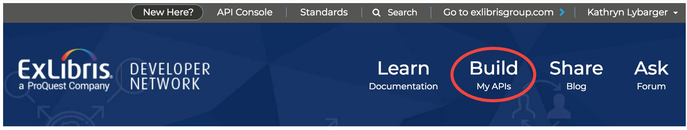
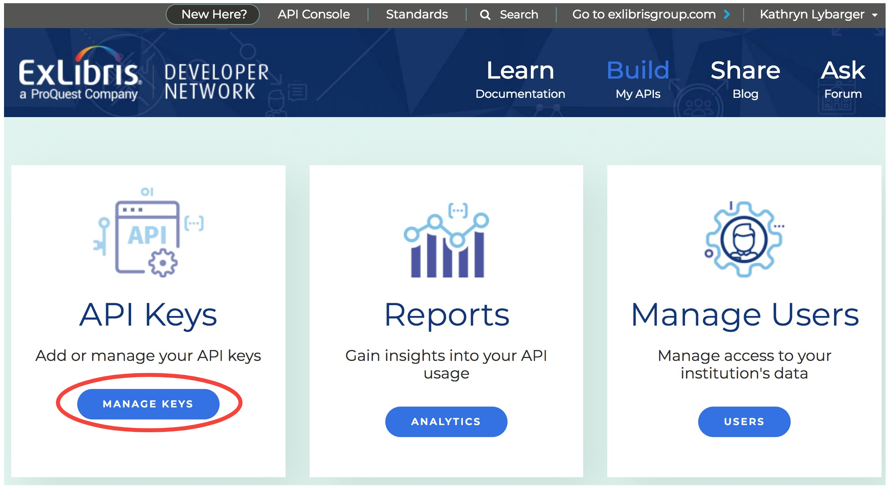
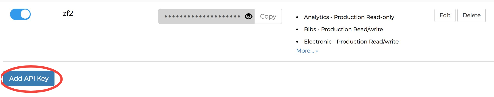
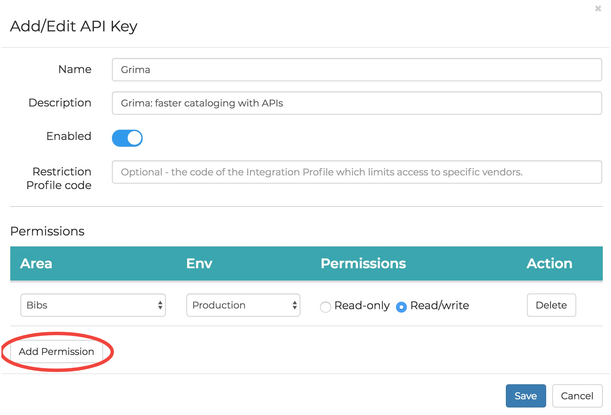

# Requesting your API key

Grima should have its own API key with appropriate permissions.
To set up an API key, first login to 
[Ex Libris Developer Network](https://developers.exlibrisgroup.com/).
If you do not yet have an account on Developer Network, you can 
create one for free. You may need to contact your system administrator
to give your account access to your Alma database.

Once you are logged in to the Developer Network, click the **Build** area:

In the left box, click **Manage Keys**:

Scroll to the bottom past any existing keys, and click the
**Add API Key** button:

Fill out this **form** with information like this. To add permissions for new
API areas, click the **Add Permission** button, and for each one, select
the Area, the Environment (production or sandbox), and the permissions you
want (Read/write or Read-only). Click the Save button to continue.

The application should now be created, and will display on the applications
list. To access the API key, click the eye symbol to make it visible, and
then click the Copy button to get it into your clipboard. 

The API key is a long string like:

  `l7xx9e21b7b5s3a4ie66xh69pcbx78cfx978`

and is what Grima will ask for when you set up your institution.
