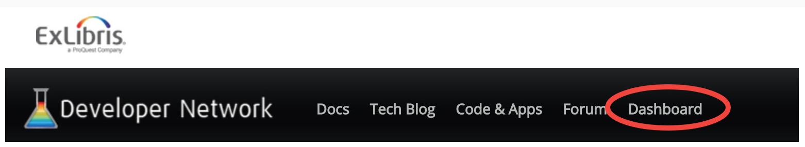
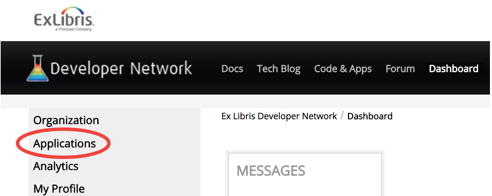
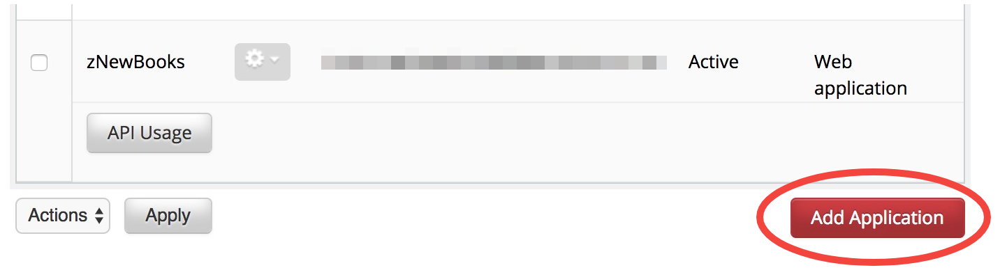
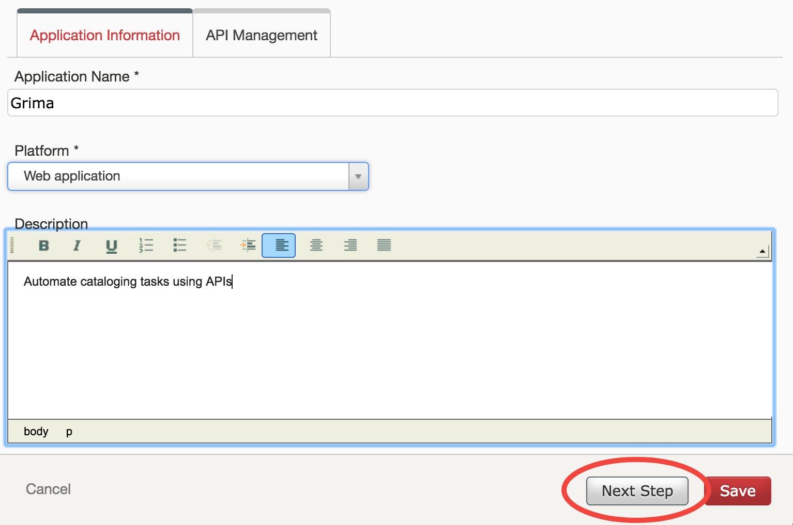
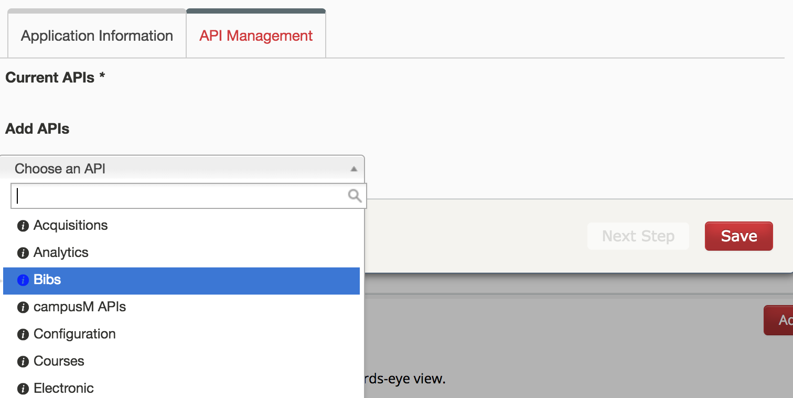
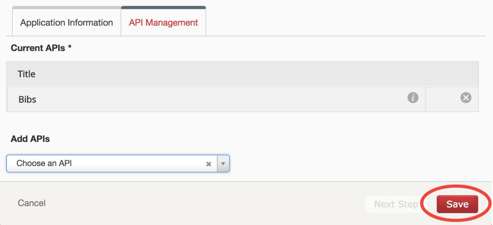
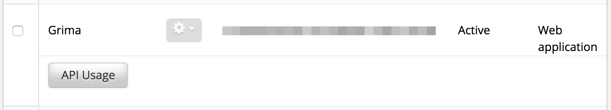
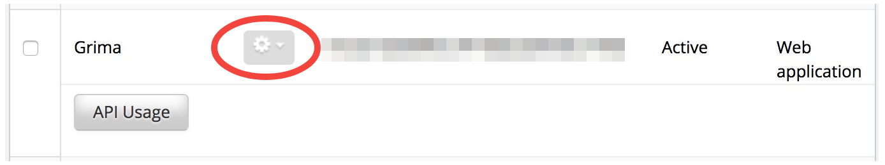
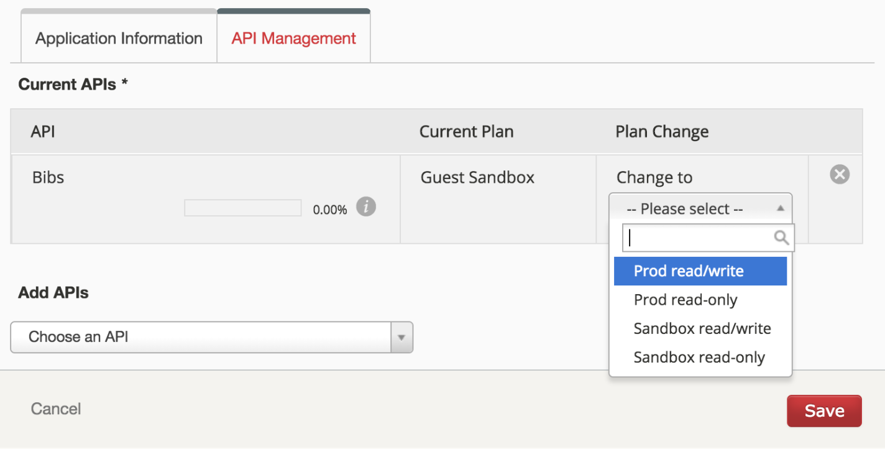

# Requesting your API key

Grima should have its own API key with appropriate permissions.
To set up an API key, first login to 
[Ex Libris Developer Network](https://developers.exlibrisgroup.com/).
If you do not yet have an account on Developer Network, you can 
create one for free. You may need to contact your system administrator
to give your account access to your Alma database.

Once you are logged in to the Developer Network, go to the **Dashboard** tab:

Go to **Applications** on the left menu:

Scroll to the bottom, and click the **Add Application** button:

Fill out this **form** with information like this, and click Next Step:

**Select an API** you want to use with Grima, such as Bibs. The documentation for
each grima indicates which APIs it requires. 

After you **Accept the Terms and Conditions**, the API you selected will be on
the list for this application. Click Save to continue:

The application should now be created, and will display on the applications
list with its API key (obscured on this screenshot). The key is a long string like 

  `l7xx9e21b7b5s3a4ie66xh69pcbx78cfx978`

and is what Grima will ask for when you set up your institution.

By default, the key is set up to work on your sandbox. If you want to use
Grima on production data, click the **gear** and choose to **Edit** the
application.

Go to the **API Management** tab, and choose the API permissions you want here
from the dropdown under Plan Change:

You can also add additional API access (such as Electronic) from this screen.
Click Save to confirm the changes.

