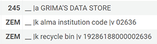

# Grima Data Store

Grimas usually don't need information beyond their input, but letting
them store some information can make them work better, and save you from
giving them that input multiple times. For example:
* the ID of a set used by multiple grimas
* your five-digit institution code
* an API key for an external source

Grimas can store this information using the Grima Data Store (GDS), a single
suppressed bib/holding/item in your catalog.

## Setup

If a grima requires the GDS, it may set it up for you the first time
you run that grima. In Alma, this looks like:

* A **bib record** with title `GRIMA'S DATA STORE`, and a bunch of fields
with tag `ZEM` and a key/value pair in subfields `$k` and `$v`, for example:



* A **holding record** with randomly chosen library and location. You can
change these with no effect in Grima if other values make more sense for
your library.

* An **item record** with barcode `GRIMABYZEMKAT`; this helps Grima to quickly
find the data store.

Some grimas will only use the GDS if it already exists. You can set up
the GDS directly using the GdsSetup grima. 

If you no longer want to use the GDS (and any grimas that require it)
you can destroy it using the GdsDestroy grima (or just delete that
bib, holding, and item from your catalog).

## Data Store fields

You can add your own fields to the data store, but there are some
that are used by standard grimas:

* `alma institution code` - the last five digits of identifiers for your
institution. Used to identify or correct identifiers in grimas (this field
is placed in the data store by default when it is created)
* `recycle bin` - used by Recycle, RecycleBinEmpty, RecycleBinClean to remember
the ID of the set used for recycling records

## Using the Data Store in new grimas

If you want to **check** whether the data store has been set up, you
can do so with the static method "exists":

```
	if (GrimaDataStore::exists()) {
		...
	}
```

If you want to **set up** the data store, you can do so by declaring
a new data store object:

```
	$ds = new GrimaDataStore();
```
This will set up the data store if it doesn't exist, and otherwise
just create an object that will give you access to it.

Once the data store is declared, you can read, add, modify, or delete fields
by treating it like an **array**:

```
	$set_id = $ds['recycle bin'];
	$ds['old field'] = 'howdy';
	$ds['new field'] = 'chowder';
	unset($ds['new field']);
```

When you run commands like these, the changes will be made immediately in
the data store; there is no need to update the record in Alma manually.

Are **you** using the Grima Data Store? Please let me know which keys
you are using and I'll add you to the list above!

