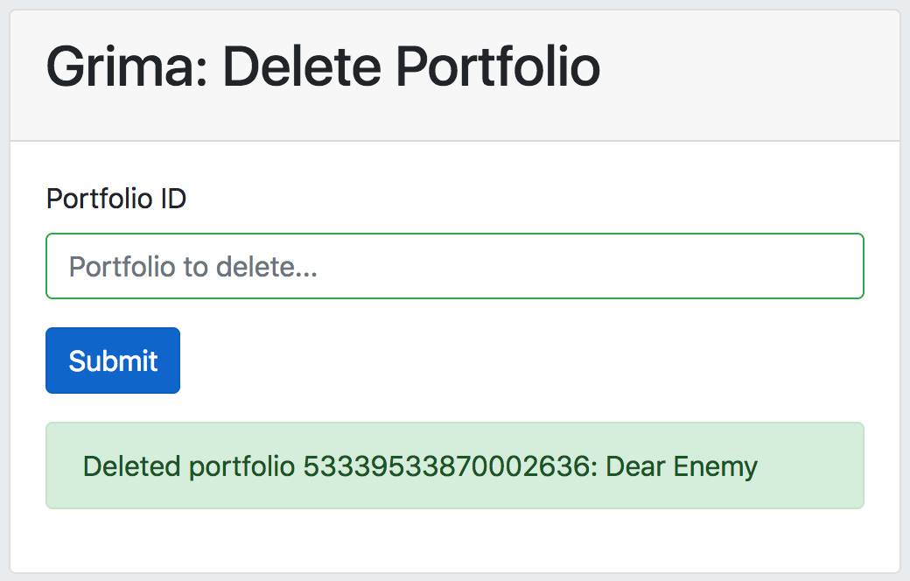
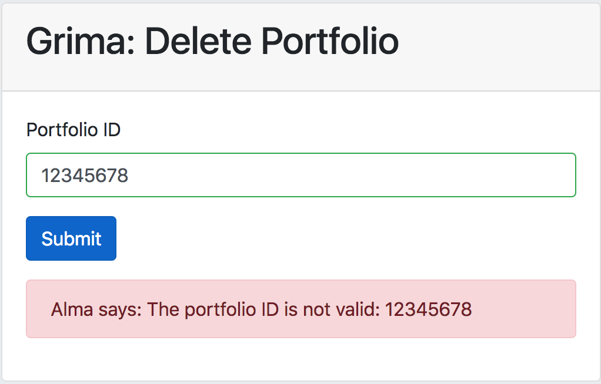

# Grima for developers

The main purpose of grima itself is to make it fast and
simple to write new workflow helpers (grimas). Each grima
is a directory (like `MyGrima/`) containing files like:
* `MyGrima.xml` - specifying input
* `MyGrima.php` - specifying behavior
* `MyGrima.css` (optional) - styling 
* `MyGrima.md` (optional) - documentation
* `MyGrima/images` (optional) - supporting image files 
* `MyGrima/splats` (optional) - any fancy output

### Specifying Input (XML)

If your grima takes input (most do), you can specify those
fields using an XML document like the following:

    <GrimaForm>
        <Title>Grima: Insert OCLC Number</Title>
        <Field
            name="mms_id"
            label="MMS ID of Bib"
            autocomplete="off"
            required="yes"
            placeholder="Bib to edit..."
        />
        <Field
            name="oclcnum"
            label="OCLC Number"
            autocomplete="off"
            required="yes"
            placeholder="OCLC Number to Insert..."
        />
    </GrimaForm>

When you run the grima, this will generate a form like this
one:

The elements are:
* GrimaForm - the root element of the input description
    * Title - Title of the form
    * Field - Input field. This is repeatable, so create one for each input.
        * name - the name of this field in the PHP
        * label - will appear above the textbox
        * autocomplete - should this autocomplete? (yes or no)
        * required - is this field required? (yes or no)
        * placeholder - will appear in gray in the textbox

### Specifying Behavior (PHP)

Your grima's behavior will be specified by its PHP file, like this one
for the grima called DeletePortfolio:

    <?php

    require_once("../grima-lib.php");

    class DeletePortfolio extends GrimaTask {

        function do_task() {
            $port = new ElectronicPortfolio();
            $port->loadFromAlmaX($this['portfolio_id']);
            $port->deleteFromAlma();
            $this->addMessage('success',"Deleted portfolio {$port['portfolio_id']}: {$port['title']}");
        }

    }

    DeletePortfolio::RunIt();

A few notes:
* The file `DeletePortfolio.xml` specifies a field called `portfolio_id`,
so we can refer to it as `$this['portfolio_id']` here.
* Objects like ElectronicPortfolio have properties like `portfolio_id`
and `title` that we can refer to and sometimes change. See the 
[docs](dev/classes.html) for each object for a complete list.
* Once we have created a new object, we can run its methods like 
`deleteFromAlma`, `addToAlma`, `updateAlma`. See the 
[docs](dev/classes.html) for each object for a complete list.
* After the task succeeds, you should explicitly add a "success" message
that will appear to let the user know the task succeeded:

* Other types of messages you can add are `info`, `warning`, `error`, and
`debug`.
Some of these are used by the Grima library as part of its error checking:

### Output: Display with another grima
The default behavior when a grima succeeds is to display the form again
with any messages. If you want to call another grima, you can do this
by overriding the `print_success` method of the GrimaTask, as is done
in [InsertOclcNo](../grimas/InsertOclcNo/InsertOclcNo.md):

    function print_success() {
        do_redirect('../PrintBib/PrintBib.php?mms_id=' . $this['mms_id']);
    }

After the OCLC number has been successfully inserted into the specified
record, the newly edited record is displayed using the
[PrintBib](../grimas/PrintBib/PrintBib.md)
grima
so that the user can confirmed that it worked correctly.

[Hierarchy](../grimas/Hierarchy/Hierarchy.md) is another good choice for displaying a newly modified
record tree.

### Output: splats template engine
As seen in the above example, you can override the default output behavior
by specifying your own `print_success` function inside your GrimaTask.

You can also trigger different behavior in `print_success` using the 
splats template engine. See [PrintBib](../grimas/PrintBib/PrintBib.md),
[Hierarchy](../grimas/Hierarchy/Hierarchy.md), and
[MoreItems](../grimas/MoreItems/MoreItems.md) to see this in action.

(Documentation coming soon!)
