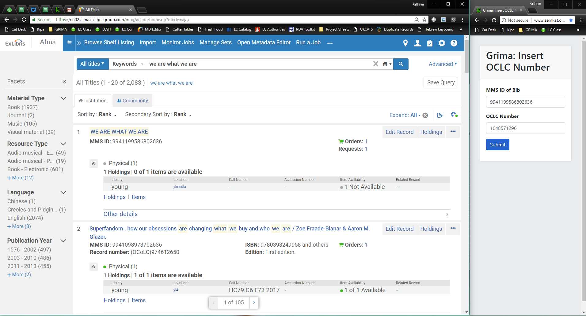

# Effective use of Grima

One hard part of using new software is seeing exactly
how it can make your efforts easier and more effective.

Here are some examples of how Grima can be used:

## A web page of grimas

Probably the easiest way to get started. Create a web page or libguide
(or use the [included page](../README.md)) to see what grimas are available.

## The bookmark folder

Make a bookmarks folder in your web browser for your commonly used grimas. 
As Alma is web-based, it effectively becomes an additional Alma menu.
Every user can make their own list of the ones they use most, as easily
as dragging them from a web page like the one above. You can even include
a bookmark to Alma in this folder to easily jump back to the main site.
You might also include a bookmark to the full page of grimas, so you don't
clutter your menu with grimas you want to remember but don't use frequently.

While you cannot have two tabs of Alma open at the same time in your browser,
this is no problem for grimas. You can have as many as you like open in additional
tabs without interfering with Alma.

## The skinny grima

Have a skinny window off to the side with a grima in it.
You have a main window with Alma, or OCLC, or other cataloging
software open and use the two softwares in concert.

