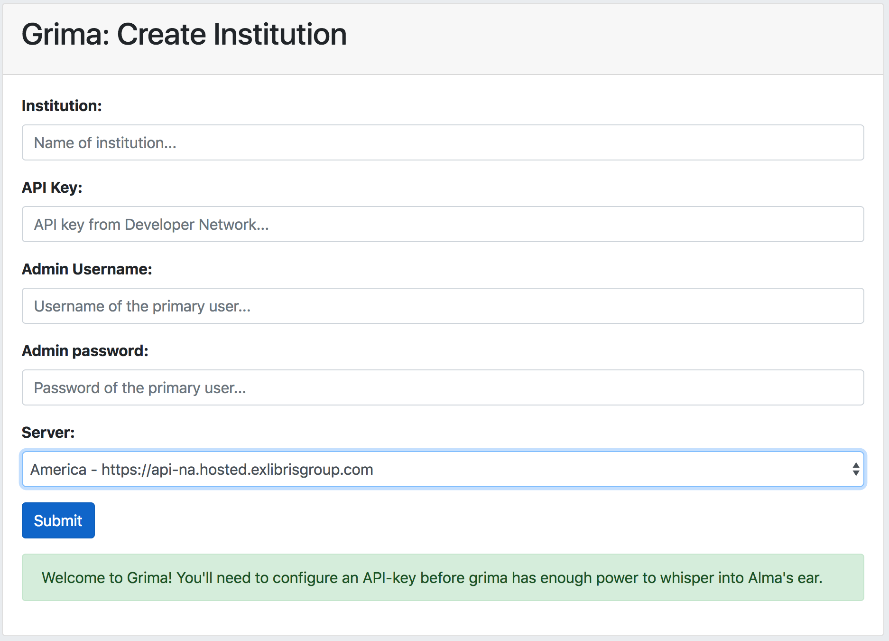
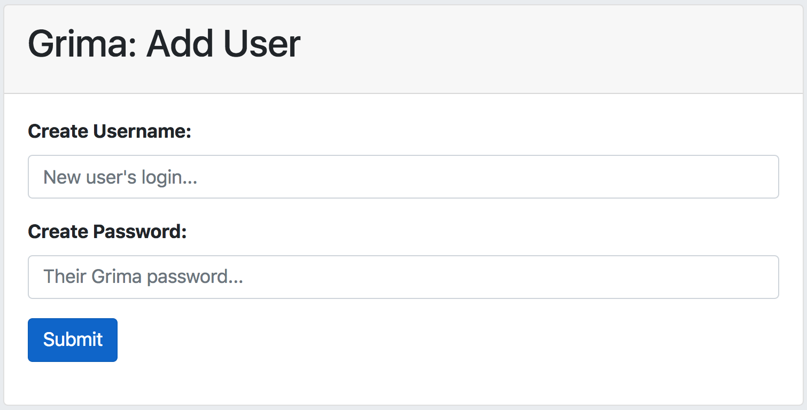

# Setting up Institutions and Users

Authentication in Grima is done through user accounts affiliated with
institutions. When you first run Grima, you will be prompted to create
an institution and its first user.

## Creating your institution

Institutions are created using
[AdminAddInstitution](../grimas/AdminAddInstitution/AdminAddInstitution.md). This will be
called automatically if you try to run any other grima, but have not yet
set up authentication:

**Institution**: This can be anything you want, like
"University of Kentucky" or "UKY".

**API Key**: Request from Ex Libris ([instructions here](APIKEY.md))

**Admin Username**: Username for the person who will be
making other Grima accounts. If only one person will be using
Grima, make their account here.

**Admin Password**: Password for the Grima admin.

**Server**: Use one of the following servers:
* America: https://api-na.hosted.exlibrisgroup.com 
* Europe: https://api-eu.hosted.exlibrisgroup.com 
* Asia Pacific: https://api-ap.hosted.exlibrisgroup.com 
* Canada: https://api-ca.hosted.exlibrisgroup.com 
* China: https://api-cn.hosted.exlibrisgroup.com

Click **Submit** to create your institution.

## Creating users

If someone other than you is going to use Grima, they should have their
own login and password. You can create these with 
[AdminAddUser](../grimas/AdminAddUser/AdminAddUser.md):

## Additional institutions

Even if all of your users are at the same institution, you may wish to
create additional institutions to allow for different user permissions.
All users in a given institution will be using its API key, so will
effectively have the same permissions.

If you set up your institution (e.g. "UKY") to have read-write access, 
but would like other users to have read-only access (for example, 
to be able to Print records or view them in a Hierarchy, but not 
change them), you could make a second institution (e.g. "UKY read-only")
using an API key with those permissions.
