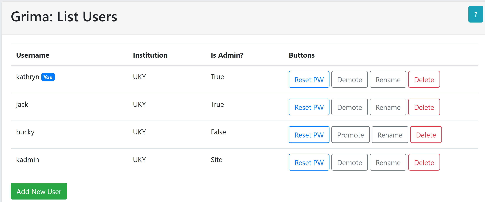

# AdminListUsers - list all the users

This is the main admin dashboard for managing grima users and institutions.

Each person using grima should have their own account. 

From this page, you can:
* [reset passwords](../AdminResetPassword/AdminResetPassword.html)
* [rename accounts](../AdminRenameUser/AdminRenameUser.html)
* [promote users to admin](../AdminAdminUser/AdminAdminUser.html) or
[remove the privilege](../AdminDemoteUser/AdminDemoteUser.html)
* [delete accounts](../AdminDeleteUser/AdminDeleteUser.html).

After doing any of these tasks, you'll have the option to return to this screen.

## API requirements
* (none)
