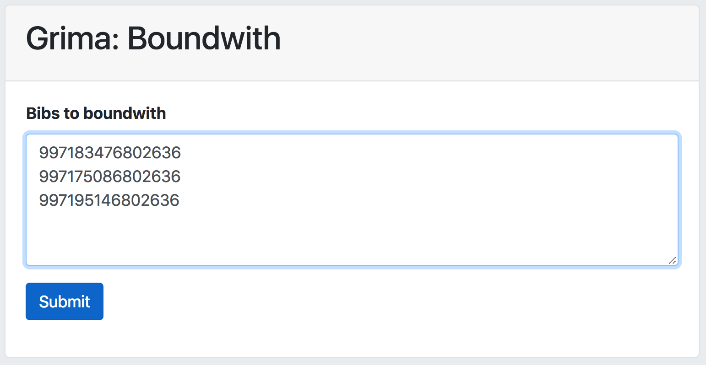
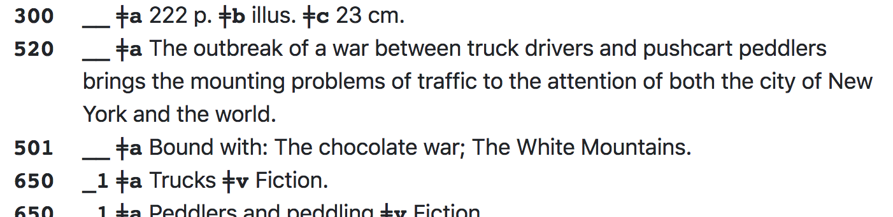

# Boundwith - create a "boundwith" structure in Alma

This grima adds fields to records to indicate that 
multiple bibliographic entities have been bound together
and should circulate as one item. These additions are:
* The first bib will have 774 fields added containing
titles and MMS IDs from the other records.
* All bibs will have a 501 "Bound with:" note added,
with a list of titles for all other bib records in the list.
* The holding record will have 014s added with MMS IDs
for all other records (for compatibility with other systems)

Overnight, a job will run identifying these as related records
and they will circulate as a boundwith.

## Input
* A list of MMS IDs, one per line. 

## Procedure
Enter the list of MMS IDs for the titles to be bound together.
The first one should already have its holding and item record.
(the other bib records do not need inventory)

After the grima runs, it outputs a list of the titles modified:

Each title on the list includes
links to [PrintBib](../PrintBib/PrintBib.html) and 
[Hierarchy](../Hierarchy/Hierarchy.html) displays 
so you can check out the changes:

The Alma process will run overnight and identify them as
related records, so they will function as boundwiths.

## API requirements
* Bibs - read/write
