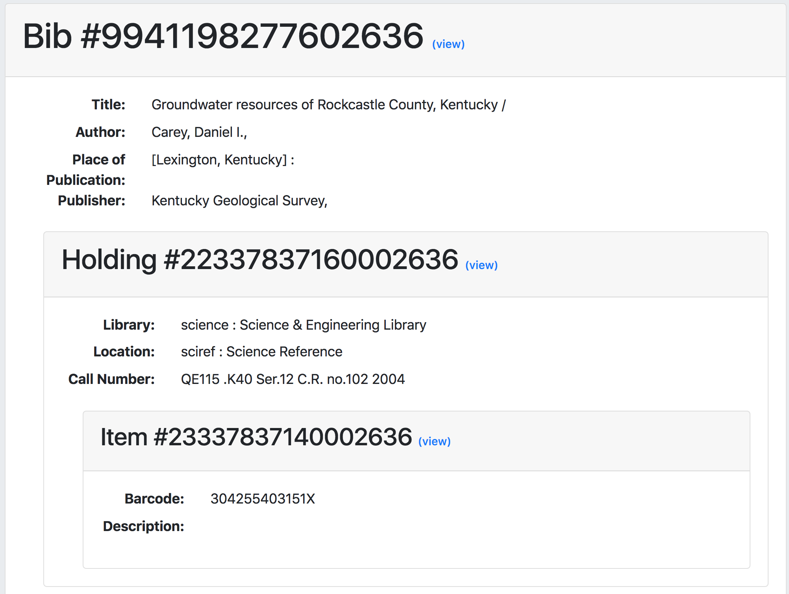

# Hierarchy - displays a bibliographic record and its inventory

This grima displays a MARC bibliographic record and its
inventory in a tree. Each record in the tree only displays
a few descriptive fields, but includes a link to view the
full record.

## Input
* MMS ID of bib record whose hierarchy you wish to see

## Output

## API requirements
* Bibs - read-only (or read/write)
* Configuration - read-only (or read/write)
