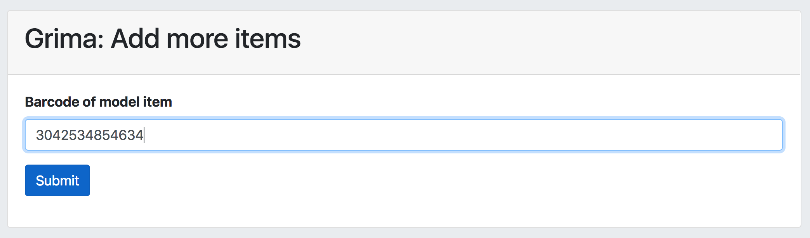
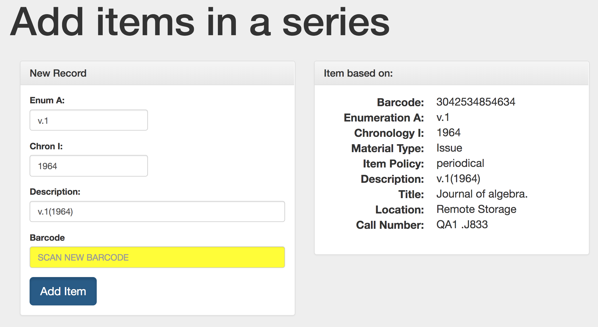
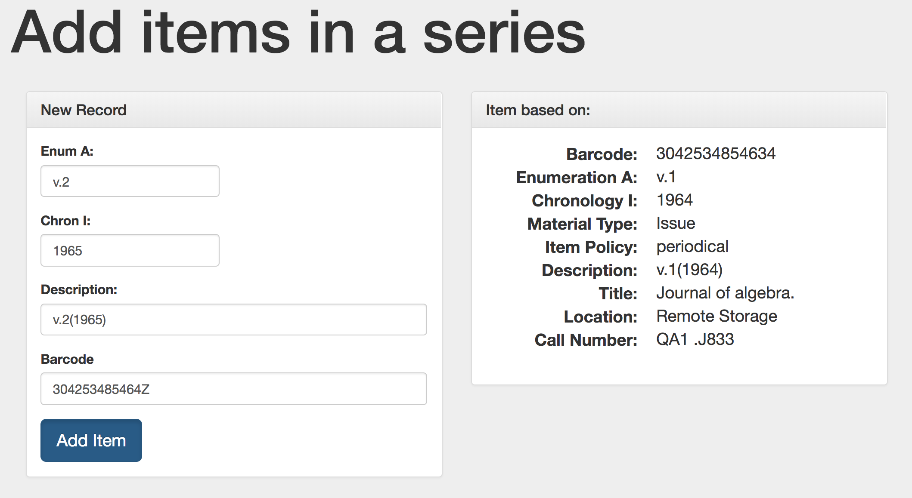
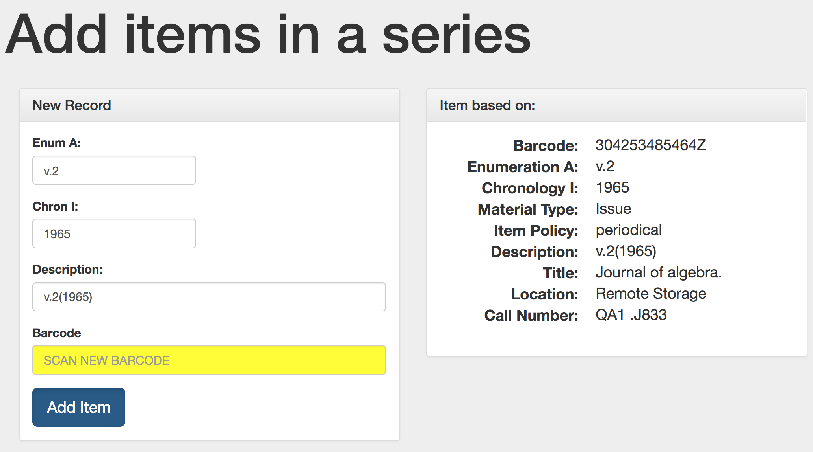

# MoreItems - add multiple similar items to a holding

This grima helps you add multiple items to a record, such as a
set or serial record. After adding each record, you will be
prompted to add a new one, with the option of changing fields
like Enumeration and Chronology.

## Input
* Barcode of "model" item, on which copies will be based

## Procedure
The first form asks for a model item. If you're adding
the newest item to a serial, enter the barcode for the
most recent issue, confirming that all fields (item policy, etc)
are correct. If the holding you're adding items to doesn't have
any yet, go ahead and add the first one as you normally would,
making sure all fields are as you want them. Then enter that
barcode into the form:

The next form will show you some of the properties of the model
item (on the right), and it also enter some of those into the
form on the left, prompting you to create your new item:

Modify the fields you need to, such as incrementing the
Enumeration and Chronology to add as the next item. No need
to "generate" the description; it will change as you type!
Then scan in the new item's barcode:

Submit the form to create the new item. After this is done,
it will bring up the form again, using the item you just added
as the next model:

Now you can quickly add lots of items in a sequence!

## API requirements
* Bibs - read/write
