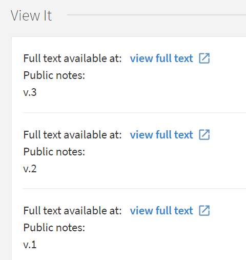
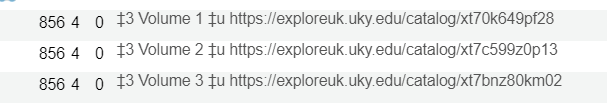
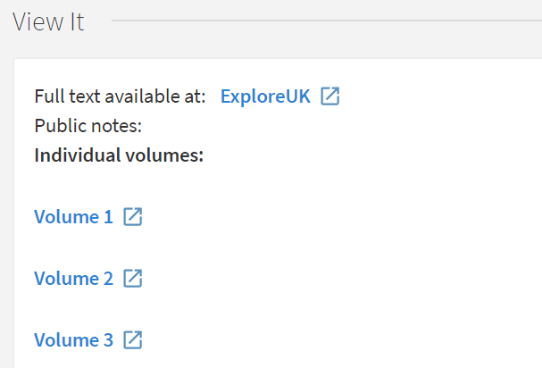

# PortfolioNoteFrom856 - creates a table of contents (built from 856), adds to first portfolio as a note

This grima modifies a portfolio to allow it to represent multiple
volumes of a work in Primo with a nice display.

If an electronic resource has multiple volumes (and separate links for
each volume), you can add portfolios for each volume to provide access
to them in Primo, which looks like this:

This works, but is not ideal -- you can't tell which link is for which
volume, and they are maybe not even in order, which you can see if you 
add public notes with their volume labels:

This grima creates an HTML note which provides a table of contents link
to all of the volumes, built from the 856s in the bib record and labeled
with their $3. Only links from 856 fields with indicators 40 will be used
to create the table of contents:

The resulting note as it appears in Primo:

## Input
* MMS ID of the bib record with the 856s; it should already have a portfolio
* Portfolio ID (optional). If the bib has more than one portfolio, you can
specify which one should get the note

## Output
This grima outputs a message indicating either:
* success - indicating the MMS ID of the bib (and inventory) deleted
* error - including the error message from Alma

## API requirements
* Bibs - read-only or read/write
* Electronic - read/write
