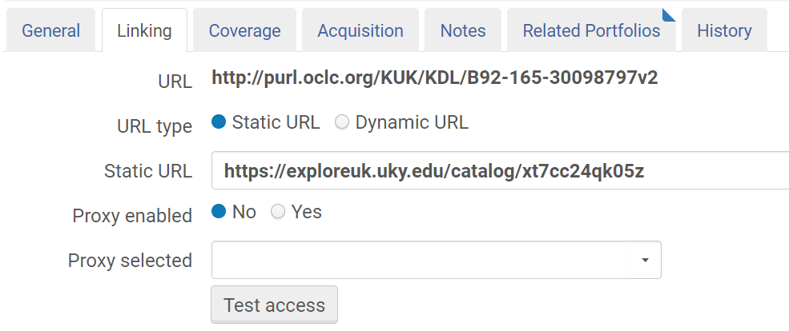
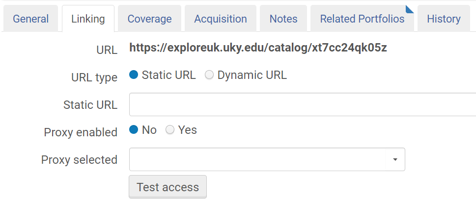

# PortfolioUpdateUrl - update the main URL in a portfolio

This grima updates the URL field in a portfolio. Once a portfolio has 
been created, it is difficult (if possible) to update the main URL; you
can set a static URL that overrides it, but that old one will still be
there, haunting you:

After running the grima, the URL field will contain the URL you provided:

## Input
* Portfolio ID of portfolio to update
* URL to add to portfolio

## Output
This grima outputs a message indicating either:
* success - indicating the portfolio updated
* error - including the error message from Alma

## API requirements
* Electronic - read/write
