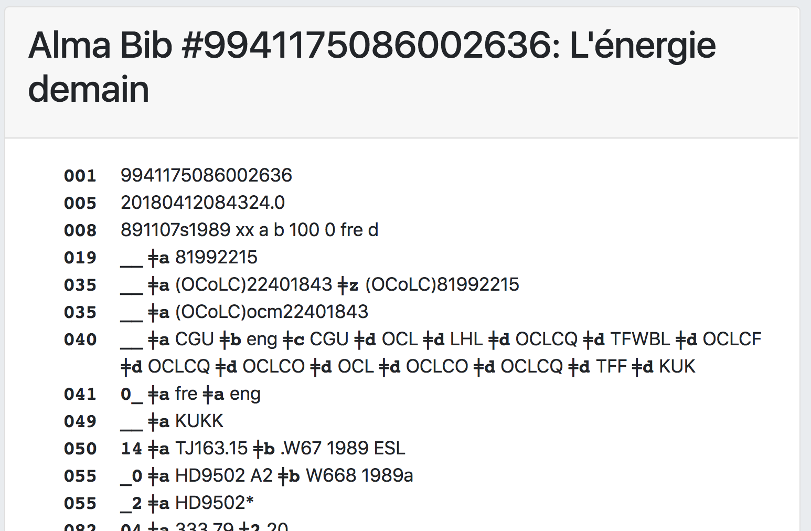

# PrintBib - view a MARC bibliographic record 

This grima displays a MARC bibliographic record from Alma
on a web page suitable for printing.

Also useful for debugging 880 issues.

## Input
* MMS ID of bib record to display

## Output

## API requirements
* Bibs - read-only (or read/write)
