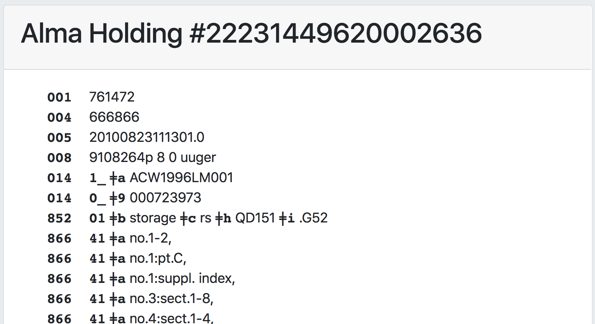

# PrintHolding - view a MARC holding record 

This grima displays a MARC holding record from Alma
on a web page suitable for printing.

## Input
* Holding ID of bib record to display

## Output

## API requirements
* Bibs - read-only (or read/write)
