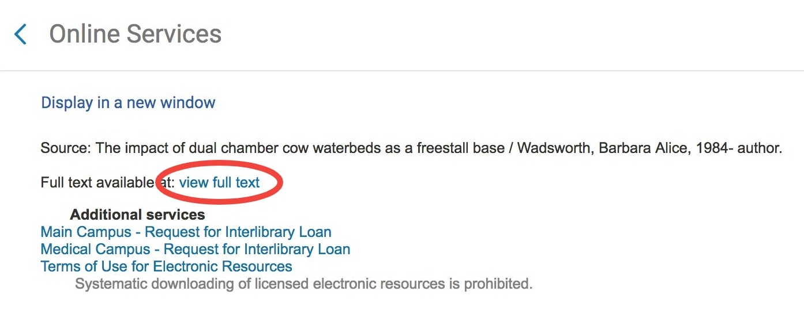
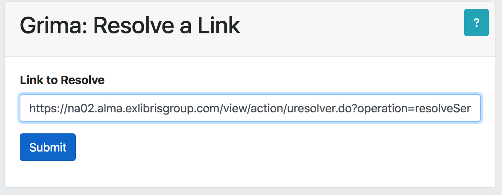
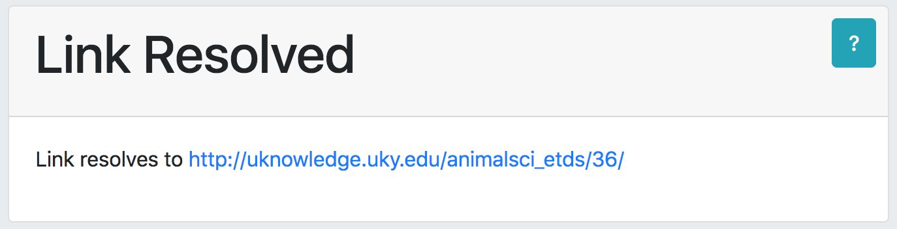

# ResolveLink - resolve a link from Alma preview or Primo display

This grima resolves a link from Alma preview or Primo display. Rather than the
Alma URL, you can see the actual URL it is trying to visit.

Useful for debugging electronic resource access problems.

## Input
* Alma URL to resolve

While editing an Alma portfolio, go to the Linking tab and click the Test
Access button. This should show a window like the one that appears for electronic
resources in Primo. Right-click the full text link and copy the link address:

Paste the URL into the grima form:

## Output
A more useful URL will be displayed:

## API requirements
* (none)

