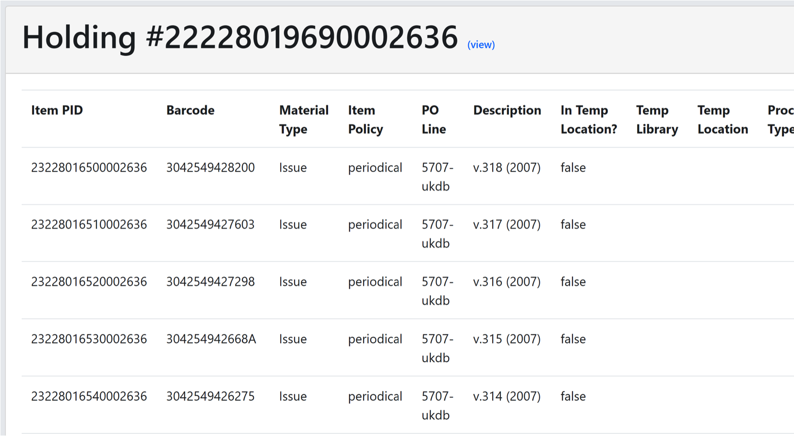

# Show Items from Holdings - show a table of all items on a holding

*Inspired by Alma Enhancement Request #5489, #5615*

This grima shows a table of all the items in the specified holding.

If the holding was created before today, the grima will query an Analytics
report to determine the MMS ID of the bib. If it does not find the Bib (for
example, because it was created today), it will redirect you to another
grima
[ShowItemsfromHoldingsB](../ShowItemsFromHoldingsB/ShowItemsFromHoldingsB.md) 
which also requests the MMS ID.

## Input
* Holding ID of holding whose items you want to see.

## Output

## API requirements
* Bibs - read-only (or read/write)
* Analytics - read-only (or read/write)
