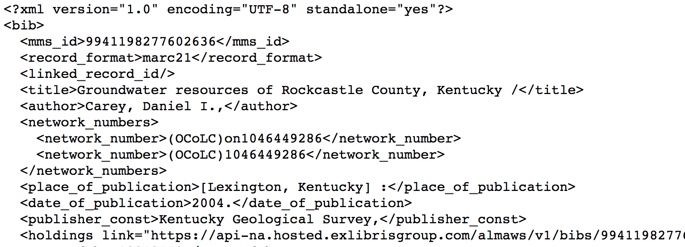

# ViewXmlBib - view Alma Bib object (XML)

This grima displays an Alma Bib object in XML.

Useful for development and debugging.

## Input
* MMS ID of bib record to display

## Output

## API requirements
* Bibs - read-only (or read/write)
