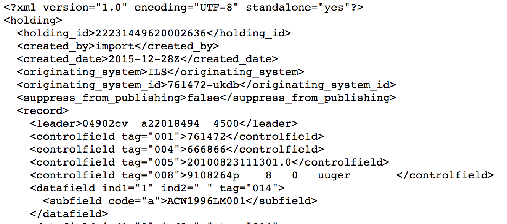

# ViewXmlHolding - view Alma Holding object (XML)

This grima displays an Alma Holding object in XML.

Useful for development and debugging.

## Input
* Holding ID of holding record to display

## Output

## API requirements
* Bibs - read-only (or read/write)
