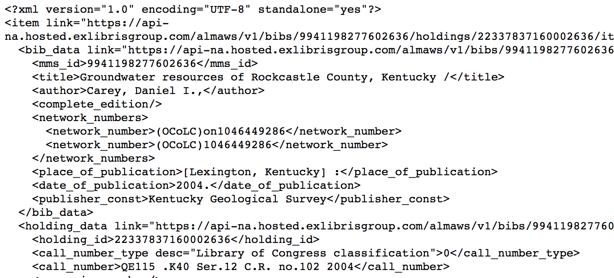

# ViewXmlItem - view Alma Item object (XML)

This grima displays an Alma Item object in XML.

Useful for development and debugging.

## Input
* Item PID of item record to display

## Output

## API requirements
* Bibs - read-only (or read/write)
