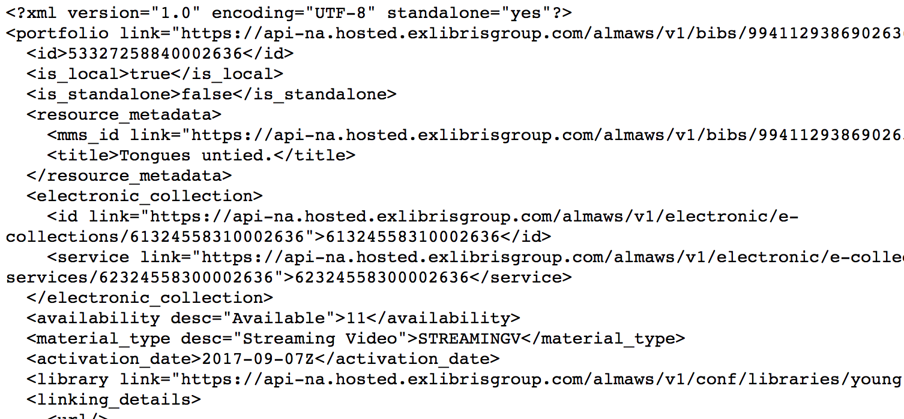

# ViewXmlPortfolio - view Alma Portfolio object (XML)

This grima displays an Alma Portfolio object in XML.

Useful for development and debugging.

## Input
* Portfolio ID of portfolio to display

## Output

## API requirements
* Bibs - read-only (or read/write)
